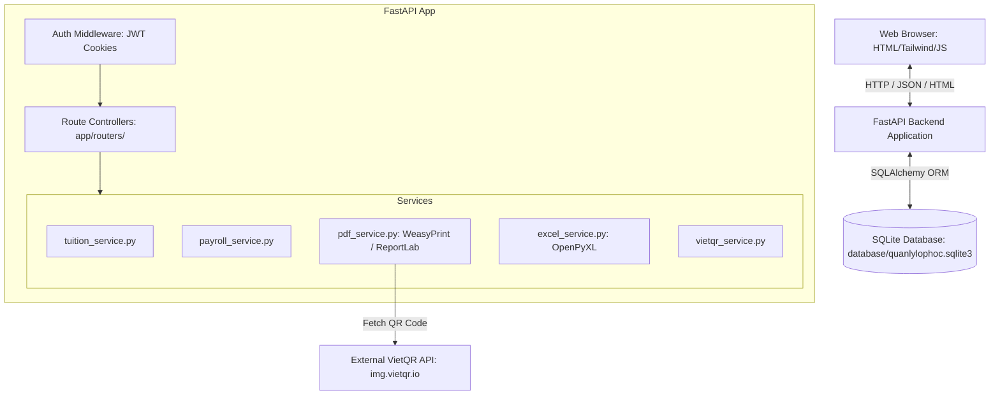
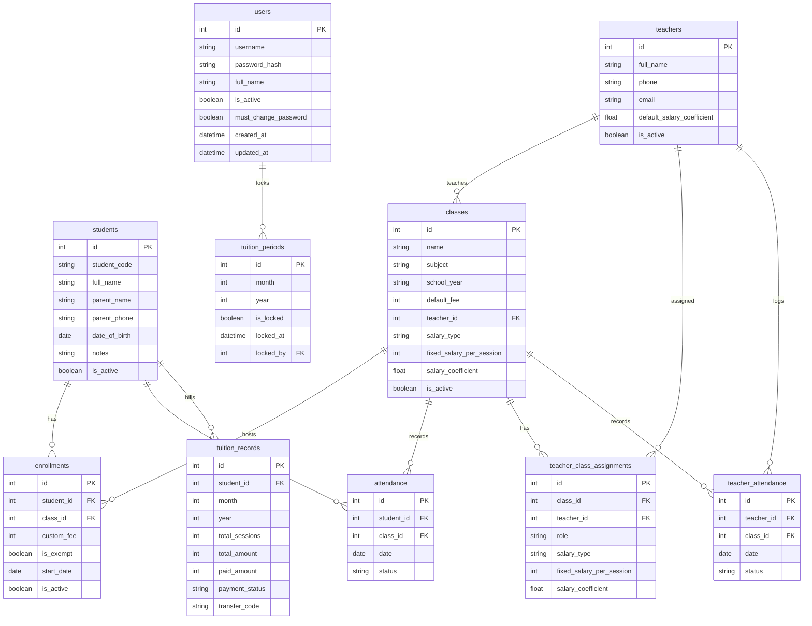

# System Architecture

This document describes the system architecture, components, database relationships, and key data flows.

---

## 1. Component Diagram

---

## 2. Entity-Relationship Schema

The database relies on SQLite mapped via SQLAlchemy. The core models and their relationships are:

---

## 3. Core Workflows & Data Flows

### 3.1. Attendance Tracking & Tuition Math
1. **Attendance Input**: Teacher/admin logs daily attendance for a class. The system inserts/updates `attendance` records with statuses: `P` (Present), `V` (Absent), or `M` (Late).
2. **Billing Generation**:
   - The user selects a month to generate tuition.
   - `tuition_service.py` queries `enrollments` for all active students in target classes.
   - It filters student `attendance` for that month, counting valid sessions (e.g., status is `P` or `M`).
   - If `enrollments.is_exempt` is `True`, the tuition defaults to `0`. If `enrollments.custom_fee` is set, it overrides the class standard fee.
   - The tuition record is calculated: `total_sessions * fee_per_session`.
   - A `tuition_records` row is created/updated in the database in "unpaid" status.

### 3.2. QR Code Invoicing
1. **Invoice Request**: Admin exports a PDF receipt for a student's monthly fee.
2. **VietQR Link Generation**:
   - `vietqr_service.py` is invoked. It checks receipt configurations (bank ID, account number, template format).
   - Formats a payment transaction content code using templates (e.g. `HP HS001 0626`).
   - Constructs the QR image URL pointing to `img.vietqr.io` using the syntax: `https://img.vietqr.io/image/{bank_id}-{account_no}-{template}.png?amount={amount}&addInfo={addInfo}&accountName={accountName}`.
3. **HTML to PDF compilation**:
   - `pdf_service.py` loads the invoice HTML template, passes student details and the generated VietQR image URL.
   - It renders it using `WeasyPrint` into a high-quality PDF. If `WeasyPrint` dependencies are absent locally, it falls back to `ReportLab`.
